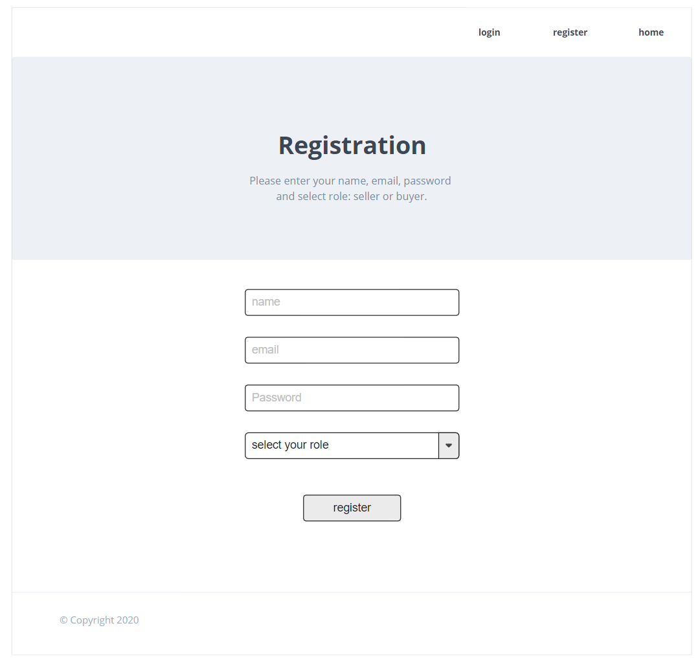
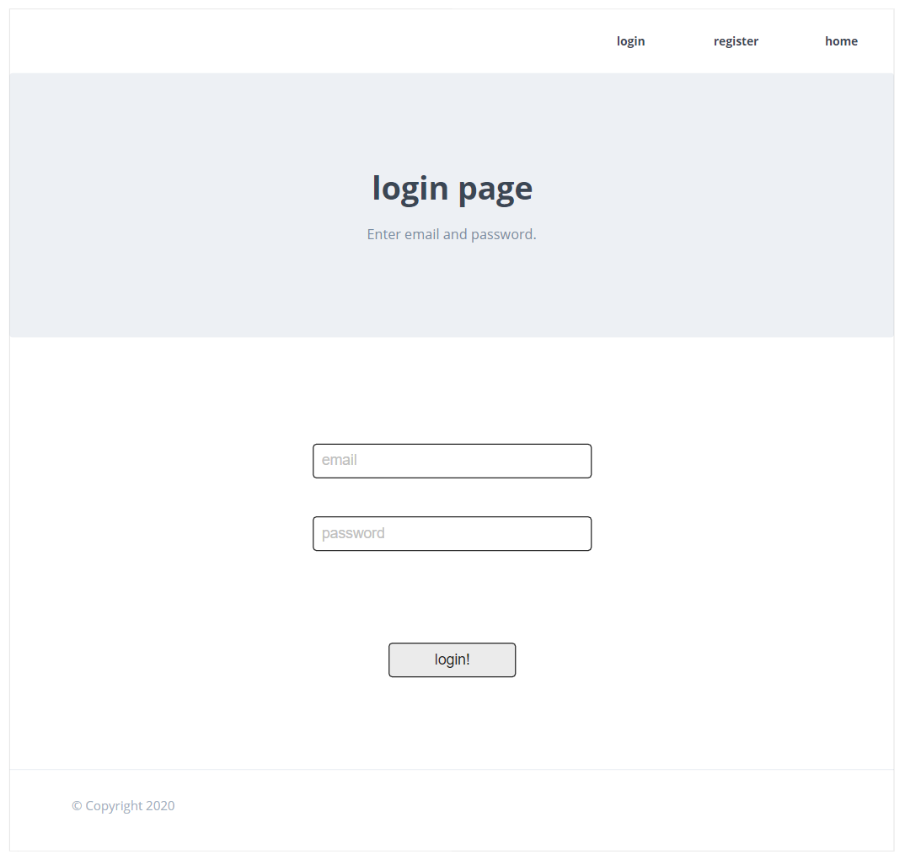
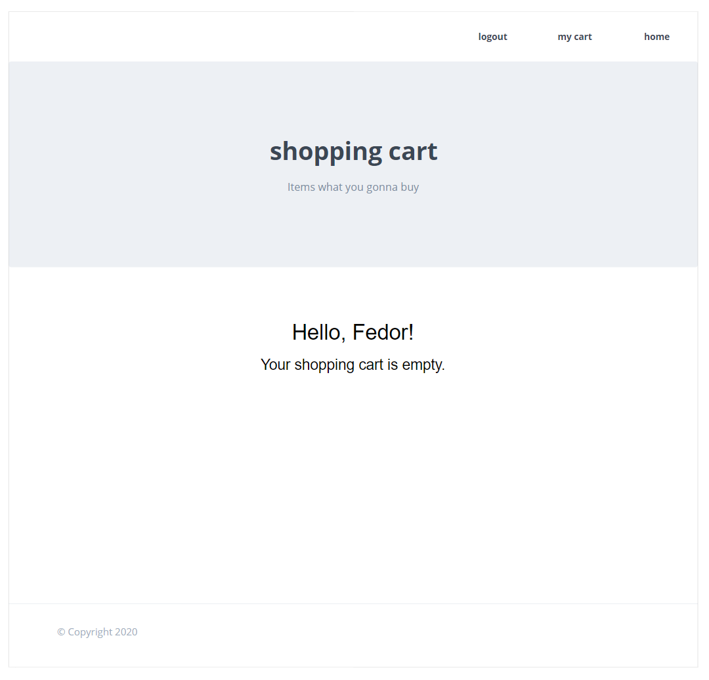
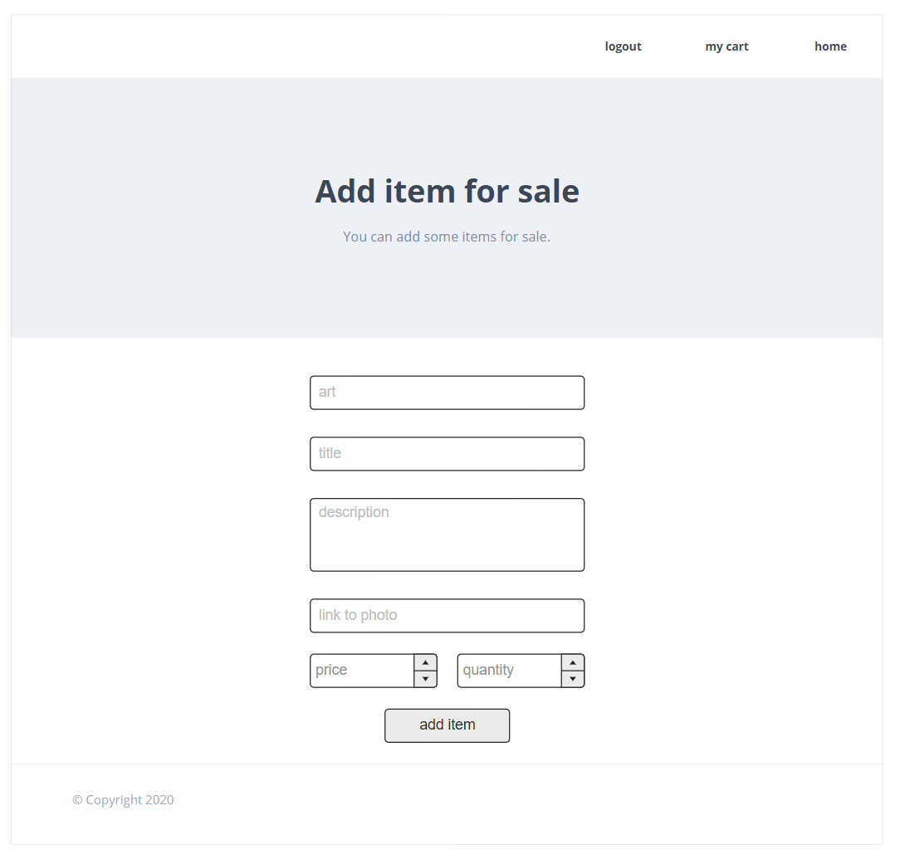
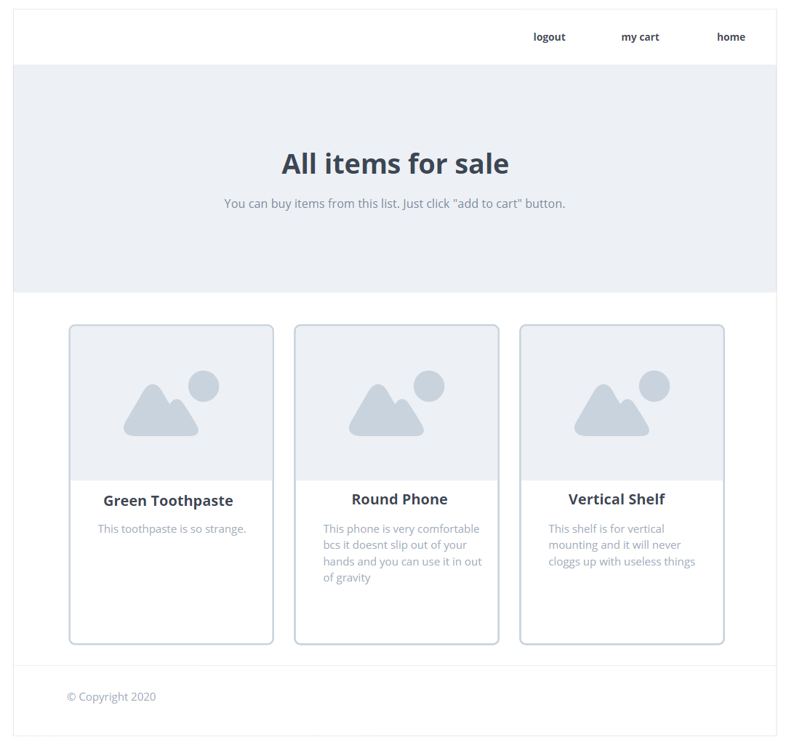
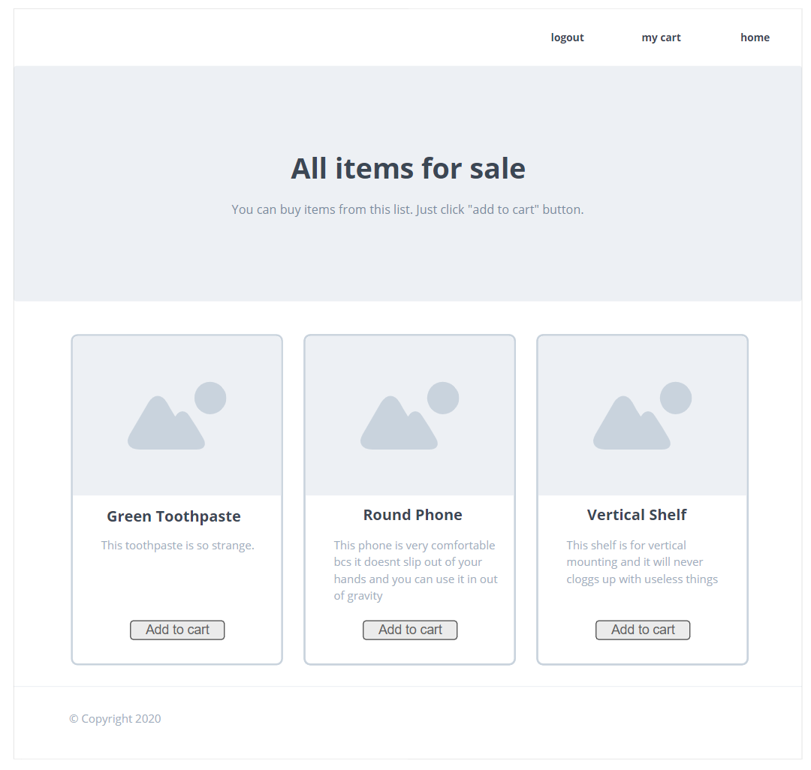
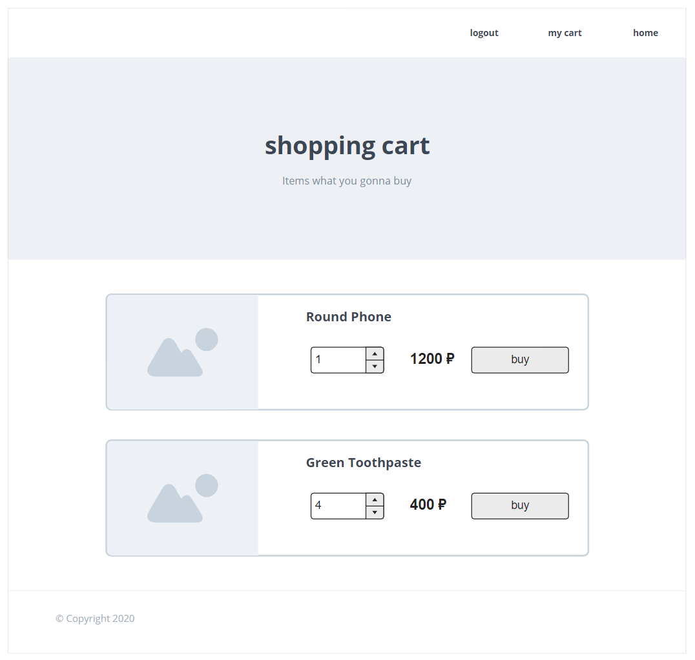
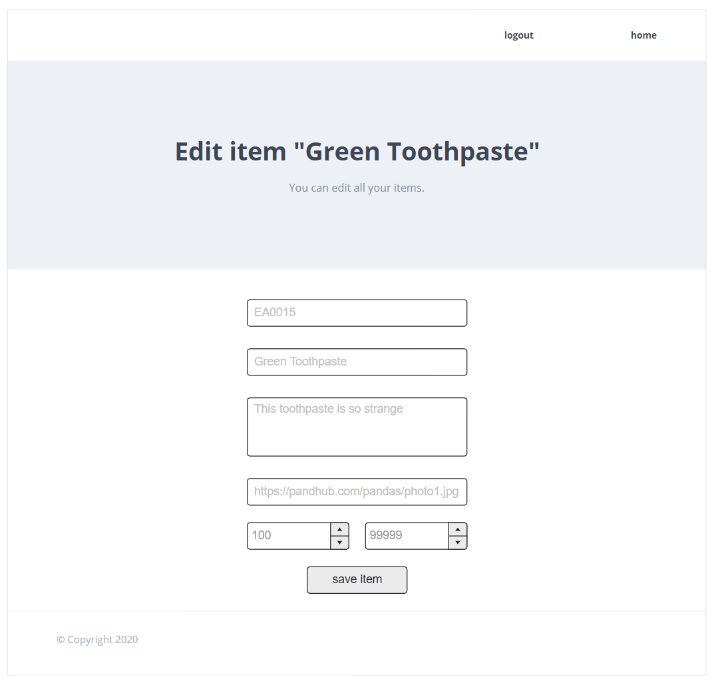
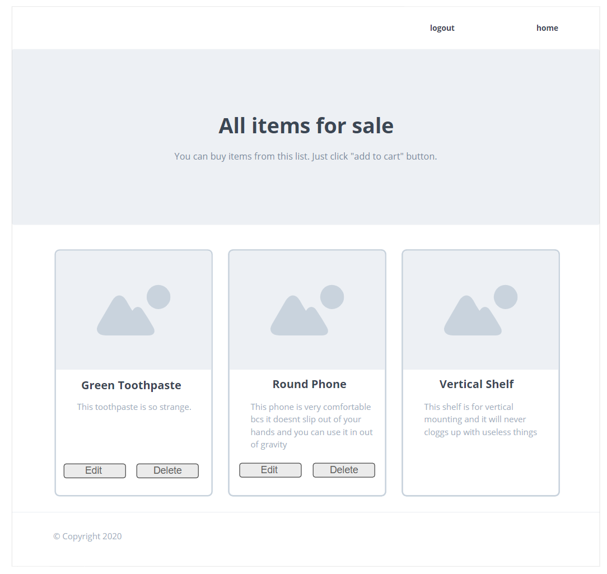
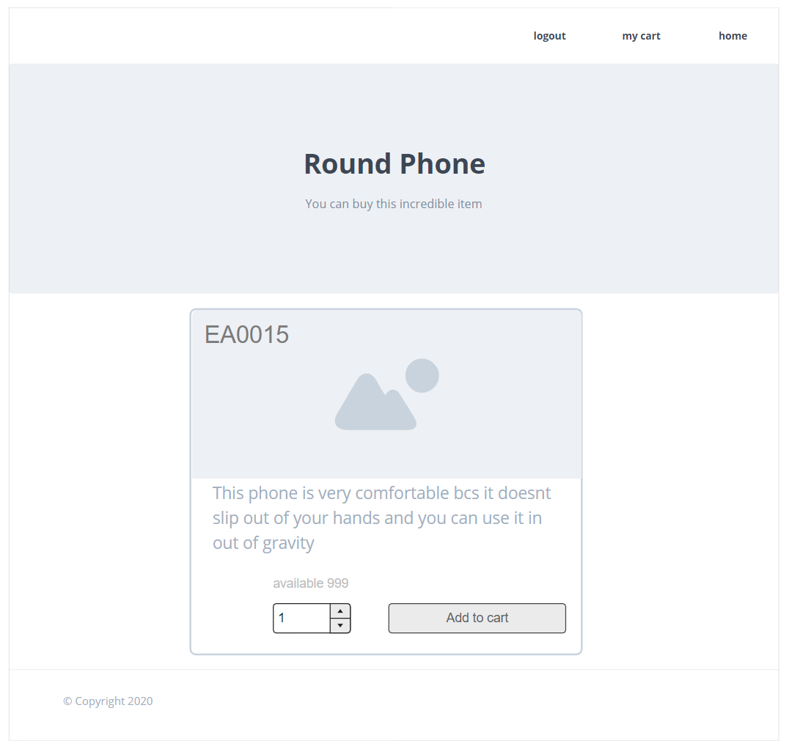

# Exam: Создание интернет-магазина

### Введение
Тебе предстоит создать свой собственный интернет-магазин. Пользователи твоего магазина смогут регистрироваться на сайте как покупатели или как продавцы. Продавцы могут добавлять товары для продажи. Покупатели могут покупать товары, добавленные продавцами. Просматривать товары могут все пользователи.

*Важно:*
Делай `git push` только один раз (в 16.00), в течение экзамена ничего пушить не нужно!

**Сначала прочитай всё задание целиком!**

Если не получается сделать какой-то релиз, переходи к следующему.

### Pre-release: Setup
Убедись, что в твоем проекте есть `.gitignore`, установлены все необходимые библиотеки, создай базу данных.

### Release 0: User Registration
Первое, что нужно сделать - это регистрация пользователей. Не забудь про шифрование паролей. Ты можешь использовать для этого [sha256](https://www.npmjs.com/package/sha256) или более продвинутую библиотеку [bcrypt](https://www.npmjs.com/package/bcrypt). Формируй свои маршруты в стиле `REST`. Тебе поможет вот эта статья на Хабре: [REST API Best Practices](https://habr.com/post/351890/)

Добавь в шапку сайта ссылки на регистрацию и на домашнюю страницу. Реализуй регистрацию. У каждого пользователя обязательными полями будут: **ФИО**, **email** и **пароль**. email должен быть уникальным у каждого пользователя. При регистрации пользователь выбирает в выпадающем меню кем он будет: **продавцом или покупателем**. Пользователь не может быть одновременно покупателем и продавцом, для этого он должен зарегистрироваться два раза. Если регистрация не удалась - пользователь должен быть оповещен об этом. Если она прошла успешно - пользователь автоматически входит в систему и перенаправляется на домашнюю страницу. Ссылка на регистрацию заменяется кнопкой `logout`. Примерно как на Рисунке 1:

  
*Рисунок 1*. Форма регистрации.

### Release 1: Login/Logout
Добавь в шапку сайта кнопку `login`, ведущую на соответствующую страницу. Не забудь обрабатывать ошибки: если у пользователя не получается залогиниться - ему нужно знать причину. При успешном входе - вместо кнопки `login` должна появляться `logout`. При нажатии на `logout` пользователь выходит из системы и оказывается на домашней странице. На данном этапе домашняя страница может быть пустой.
  
*Рисунок 2*. Login, logout.

### Release 2: Shopping Cart Page
Теперь добавь страницу с корзиной. Чтобы перейти в корзину, пользователь будет нажимать на соответствующую ссылку в шапке. На текущем этапе в корзине оставь персональное приветствие для пользователя.

  
*Рисунок 3*.  Корзина

### Release 3: Items For Sale
Теперь сделай возможность добавлять товары на сайт. Создай страницу с формой добавления товара. У каждого товара должно быть **название, описание, цена, артикул и фото** (можно использовать заглушку с [picsum.photos](https://picsum.photos/) или [placeholder.com](https://placeholder.com/)). При добавлении товара продавец указывает **количество товара**, которое будет доступно для покупки. В случае успеха - пользователь перенаправляется на главную страницу.

  
*Рисунок 3*.  Добавление товара

### Release 4: List Items For Sale
Сделай так, чтобы на главной странице были видны все добавленные продавцами товары с фотографиями, названием и описанием товара. Это все продемонстрировано на рисунке 4:

  
*Рисунок 4*. Все товары

### Release 5: Adding to Cart
Добавь кнопку "add to cart" к каждому товару на странице с товарами. После нажатия на эту кнопку выбранный товар должен попасть в корзину к пользователю, который его заказал, а количество товара, доступного для заказа уменьшается на 1.

  
*Рисунок 4*. Добавление товара в корзину

### Release 6: Improving Shopping Cart
Настало время усовершенствовать страницу корзины. Сейчас на ней только приветственное сообщение. Сделай так, чтобы на странице корзины отображались все товары, которые пользователь туда добавил. А еще сделай возможным изменять количество товаров в корзине и удалять оттуда ненужные товары.

***Примечание:***
*При изменении количества товара в корзине должно меняться общее количество этого товара на главной странице. Если весь имеющийся товар отправлен в корзину, то он становится недоступным для заказа другим пользователям и пропадает со страницы с товарами.*

  
*Рисунок 3*.  

### Release 7: Updating Items
В дальнейшем продавцам понадобится изменить свои товары. Возможно, они захотят переименовать их, изменить описание или цену. Добавь в свой проект функциональность, которая позволит пользователям это делать.
Добавь на странице с товарами ссылки `edit` к каждому элементу. По нажатию на нее у продавца должна открываться форма редактирования всех свойств выбранного товара:

  
*Рисунок 5*. Редактирование товара

### Release 8: Deleting Items
Добавь кнопку `delete` к каждому товару. После удаления товара он должен исчезать со страницы с товарами.

*Не забывай, что кнопки **"edit"** и **"delete"**  должны быть только у продавцов, при чем только на собственных товарах. Продавцы не могут отредактировать или удалить не свой товар. У покупателей на товарах отображается только кнопка **"add to cart"**.*

  
*Рисунок 6*.  Удаление товара.

### Release 9: Appropriate Behaviors per User and Route
Проанализируйте функциональность, которую вы уже реализовали. Все ли сделано верно с точки зрения логики, распределения ролей, удобства пользователя, безопасности?

* У кого есть доступ на добавление нового товара?
* Кто может редактировать товары? И какие именно?
* Кто может удалять их?
* Кто может добавлять товары в корзину?

### Release 10: Product Details
Настало время дать пользователям возможность просматривать детально товары на сайте. У тебя должен быть метод, который дает возможность просматривать детали по каждому товару как на рисунке ниже. При клике на товар должна открываться страница, на которой виден этот товар со всеми его свойствами.

  
*Рисунок 7*.  Просмотр деталей элемента.

### Release 11: Refine 
Усовершенствуй работу с сайтом для продавцов и покупателей. Убедись, что доступ разграничен правильно. Все ли верно с точки зрения безопасности?

* Каждый ли пользователь может добавлять товар в корзину, или только те, кто вошел в систему?
* Могут ли покупатели редактировать товары?
* Могут ли продавцы редактировать и удалять свои товары?
* Можно ли поменять количество товара в корзине? Удалить товар из корзины?

**Постарайся разграничить доступ к разным частям сайта согласно таблице:**
Возможности покупателей | Возможности продавцов | Доступно без авторизации
----------------- | -----------------| -----------------
Просматривать товары на сайте | Просматривать товары на сайте | Просматривать товары на сайте
Добавлять товары в корзину | ~~Добавлять товары в корзину~~ | ~~Добавлять товары в корзину~~
Удалять товары из корзины и изменять их кол-во | ~~Удалять товары из корзины и изменять их кол-во~~ | ~~Удалять товары из корзины и изменять их кол-во~~
~~Добавлять товары на сайт~~ | Добавлять товары на сайт | ~~Добавлять товары на сайт~~
~~Удалять свои товары с сайта и менять их кол-во~~ | Удалять свои товары с сайта и менять их кол-во | ~~Удалять свои товары с сайта и менять их кол-во~~
~~Редактировать свои товары~~ | Редактировать свои товары | ~~Редактировать свои товары~~

### Release 12: *
Если ты справился со всеми задачами, добавь в форму авторизации галочку `долгая сессия`. Если пользователь поставит эту галочку и авторизуется, его сессия будет храниться на сервере до тех пор, пока он не разлогинится. Если не поставит, то через час придется заново логиниться. Все товары в корзине при этом должны сохраняться.

## Заключение
Если вы не успели выполнить задание полностью, в любом случае залейте свой проект на GitHub и сформируйте `Pull Request`.

